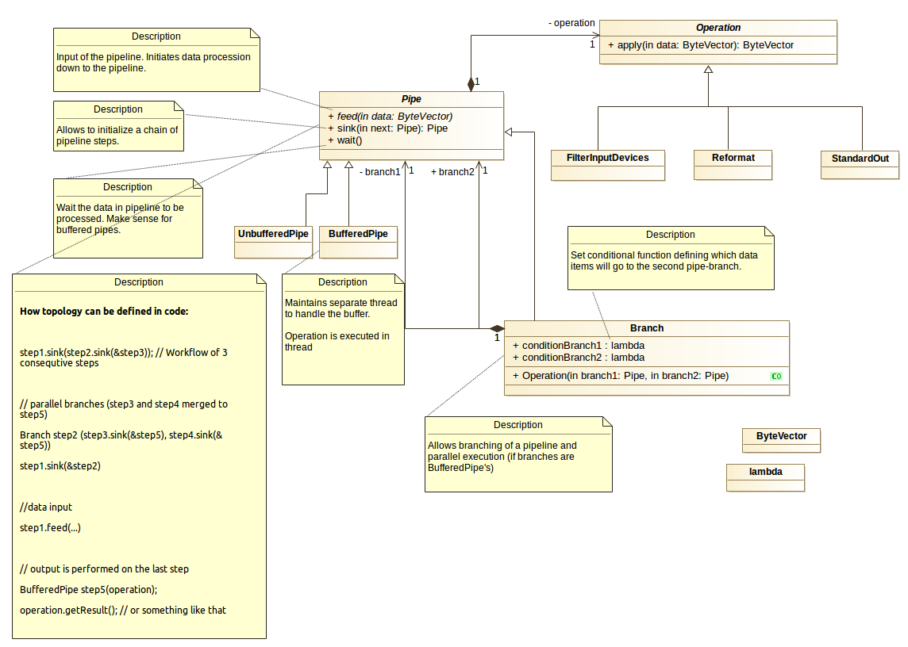

# Description

Initial assumptions:
* Infrastructure for Pipeline processing to be developed
* Pipeline is built of operations connected with "pipes".
* Operations can be performed in parallel - consider branching of data flow.
* Topology of pipeline is defined in code (aka in compile-time).
* Input data come from STDIN. A data chunk ends with one CRLF "\n". Application
monitors STDIN continuously awaiting for a new input.
* Output of pipeline goes to the STDOUT.
* Input ond output of a "pipe" can be either buffered or unbuffered.

Type of data to be processed: entries from the syslog file.

Operations to be performed:
* Get the log entries
* Filter out information about input devices
* Reformat entries to the form "device name | device location"
* Print reformatted entries to STDOUT

# Build

Standard build procedure for CMake can be applied here.

Although it is better to use build.sh script.

The following environment variables for build.sh script can be used to customize
testing procedures:

```
export DO_TESTING=1       # allow unit testing
export DO_VALGRIND_TEST=1 # perform Valgrind memory checks for unit tests.
```

# Usage

Run in your command shell
```
cat test/test.log | /tmp/pipelining/pipeline
```

# Technical details

The design is based on "Pipe-and-Filter" pattern.

Therefore the two types of elements are distinguished:
* Pipe - is responsible for data transfer from input (feed) to output (sink). Pipe accepts Operation to transform incoming data.
* Operation - is applied to the data item before it will be pushed to the next step of the pipeline.

A Pipe can be one of the following types: Unbuffered Pipes, Pipes providing buffered
access and Pipes allowing branching and parallelization of certain pipeline steps.

The topology of pipeline is built with Pipe elements without any notion of
a pipe type (against Pipe interface) directly in code.

The figure below depicts the composition of Pipe-Operation design.


